# Conveyor fault detection — analysis & current picture

Anomaly analysis from **box-mounted sensors only** (no track sensors), validated
against annotated recordings. Self-contained in this folder (own venv `.venv`; does
not modify the colleague's `wear_detector/`). Run any script with
`.venv/bin/python <script>.py` from this directory.

---

## The pitch (our USP)

Not "a clever classifier" — a **joined-up condition-monitoring system** that plays to
an infrastructure team's strengths:

> **A tiny model runs *on the sensor box*, using the full high-rate signal that never
> leaves the chip; a technician triages its alerts in a UI; those corrections retrain
> and recalibrate the model; the deploy pipeline ships the update back to the device.**

The data science below is the *evidence* that each link works: there are real,
separable fault signatures; they're cheap enough to run on the device; the operating
point is a deliberate choice; and the feedback loop measurably improves the model.
The system, not any single detector, is the product.

Two things we discovered make this the *right* architecture, not just a nice one:
1. **The real fault energy is high-frequency and the bottleneck is data transfer, not
   the sensor.** The chip samples at 1600 Hz but only bursts reach us — so inference
   belongs on-device, where the full signal lives.
2. **A single-pass detector is a good *screen* but a noisy *alarm*.** The human in the
   loop is what turns screening into trustworthy alerts — and supplies the labels that
   improve it.

---

## What we detect — two validated fault signatures

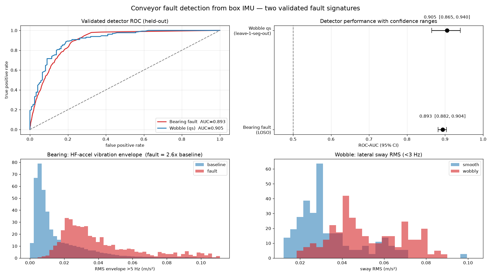

| fault | physics | held-out ROC-AUC [95% CI] |
|---|---|---|
| **Faulty bearing** | high-frequency vibration burst as the box rolls past a defective idler | **0.893 [0.882, 0.904]** (leave-one-session-out) |
| **Wobble** | low-frequency lateral sway / instability | **0.905 [0.865, 0.940]** in-regime (see caveat) |

They don't confuse each other (cross-talk checked below).

---

## Bearing fault — the signature

A defective idler-wheel bearing produces a repeatable **2–3 s burst of high-frequency
vibration** each time the box rolls over it:

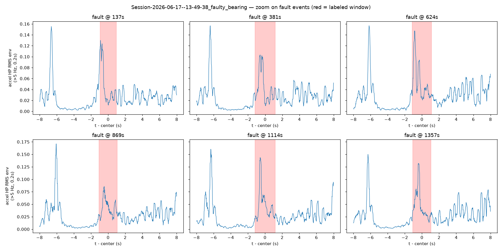

Which features separate fault from normal — high-frequency vibration energy does
(area-under-curve ≈ 0.79); the classic kurtosis/crest "early-wear" metrics **don't**
at this sample rate:

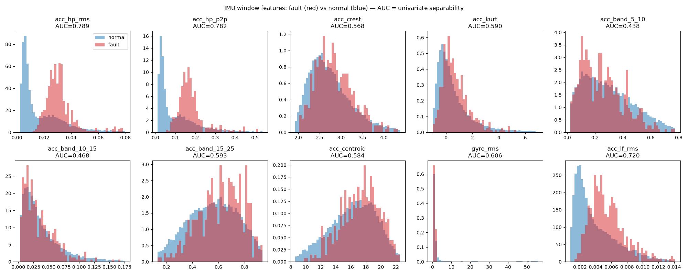

### Why it works at 50 Hz — and where the real signal hides

Rig geometry (colleague's diagram): big driven wheels **55 cm**, idler rollers
**2.5 cm** (the failing parts), empty **39 × 39 cm** box. A 2.5 cm roller spins
**22× faster** than a big wheel, so only idler defects are fast enough to see; from
burst duration the box runs at **~0.17 m/s**.

Measured against a **matched straight** (same motion state — crucial, because *turns*
are high-vibration too), the fault adds **7–21×** energy, in two lobes:

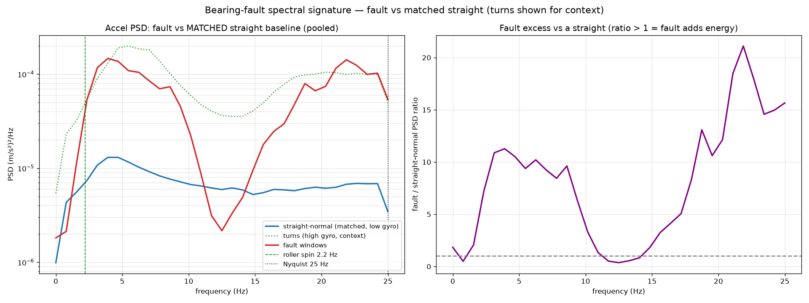

- **Low lobe ~2–9 Hz** — the box rolling over the bad roller (starts at the predicted
  2.2 Hz roller-spin).
- **High lobe 15–25 Hz, still rising into the 25 Hz Nyquist limit** — the real bearing
  ring lives **above 25 Hz and aliases down**. This is the data-driven case for higher
  sample rate / the microphone.
- **Gyroscope is essential**: it tells faults (high-vibration on a *straight*) apart
  from turns (high-vibration *while turning*).

### Severity — a direction, not a counter

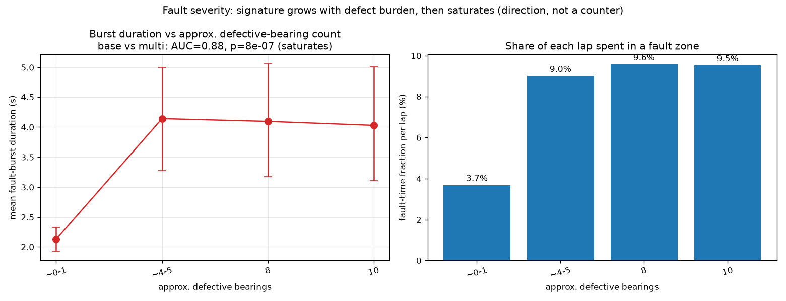

As the colleagues added defective bearings, the signature grew: single-defect runs
(~2.1 s bursts, 3.7% of each lap in a fault zone) step up clearly to multi-defect runs
(~4.1 s, ~9.5%) — **p < 1e-6, AUC 0.88**. But it **saturates** beyond a few defects and
the absolute counts are ambiguous (see "open items"), so present it as *"wear is
getting worse"*, not a calibrated bearing count.

---

## Wobble — and making it deployable

Different physics (low-frequency lateral sway); best single feature is sway RMS below
3 Hz (area-under-curve 0.79):

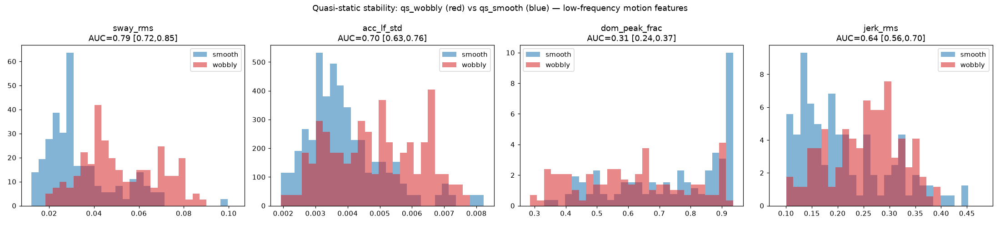

**Regime-shift caveat & fix.** The 0.905 figure is *within the slow quasi-static test
regime*. Cross-talk analysis showed the absolute-threshold model fires on ~68% of live
running motion (it reads normal running as "wobbly"). Recalibrating to **per-recording
relative features** ("wobblier than this unit's own baseline") cuts that over-firing
from **68% → 9%**, costing only 0.905 → 0.843 in-regime accuracy:

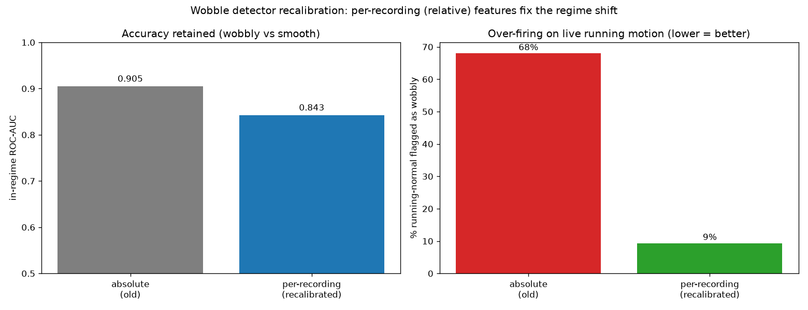

(Still unvalidated: running-wobble *recall* — we have no wobble labels on running data.)

### The two detectors don't confuse each other

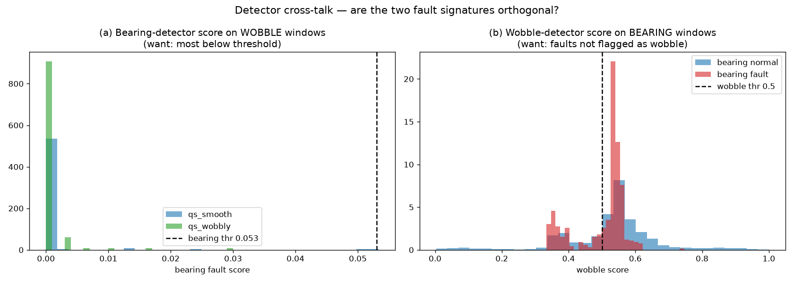

A bearing fault does **not** trip the wobble alarm (0.0% firing), nor vice-versa — the
signatures are orthogonal.

---

## How good is it really — false alarms vs misses

This is the number that matters, not just AUC.

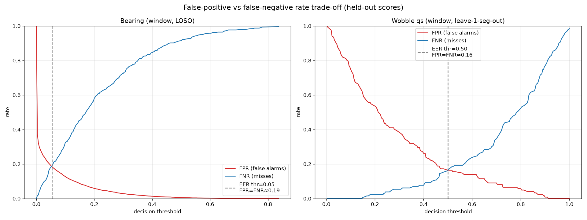

Window-level (held-out, 95% CI). **Equal-error** = the symmetric point where the two
rates cross; it is *not* a target — with a technician filtering false positives cheaply,
operate at **low miss-rate (high recall)** instead.

| detector | operating point | FPR (false alarm) | FNR (miss) |
|---|---|---|---|
| Bearing | equal-error | 0.19 | 0.19 |
| Bearing | high-recall | 0.24 | **0.10** |
| Wobble  | equal-error | 0.16 | 0.16 |
| Wobble  | high-recall | 0.22 | **0.09** |

Per **event**, a sensitive bearing setting misses **0%** of fault events — but raw
false alarms are high (~250/hr). So single-pass = strong **screen**, not standalone
**alarm**. The fix is the human loop (next), **not** lab tricks like assuming a fault
recurs at the same track spot (useless on a km-scale line).

---

## The microphone & the high-rate signal

The IMU captures only **1–6%** of the available mechanical signal energy; the mic's
band is **160–320× larger** (8 kHz vs 25–50 Hz), right where the bearing ring lives:

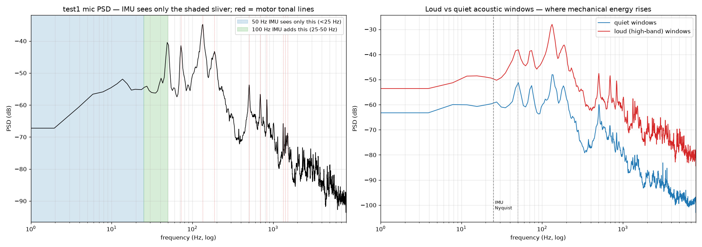

**Validated against the colleague's manual labels** (24 five-second clips, 6 faults).
A naive first pass (normalized band *fractions*, averaged over the whole clip) scored
≈ chance (AUC 0.57) — but that was a *methodology* bug: it normalized away loudness and
averaged out the transients. Looking at fault vs normal clips shows why — faults are
**high-frequency, loud and sustained**:

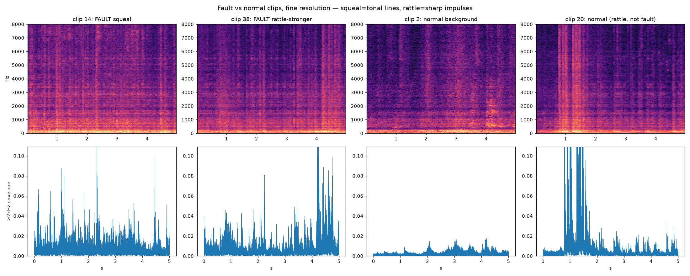

Rebuilding the indicators to be **absolute, high-band (>2 kHz), and transient-aware**
recovers the signal the human ear hears — the single best indicator (median high-band
level) reaches **AUC 0.89**:

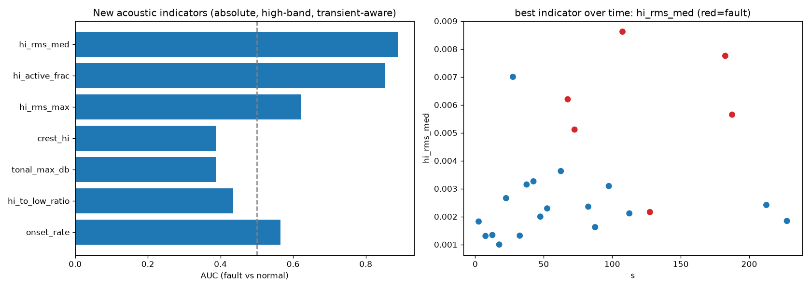

| acoustic indicator | meaning | AUC |
|---|---|---|
| `hi_rms_med` | median >2 kHz loudness over the clip | **0.89** |
| `hi_active_frac` | fraction of clip with active high-band sound | 0.85 |

Equal-error point: **FPR 0.06, FNR 0.17**. A faulty bearing is simply *louder and more
sustained in the high band* — exactly "rattle/squeal" to a human. The one miss is the
vague "vibration" clip; the one false-alarm is a loud-but-not-flagged "rattle" clip
(label-boundary cases). With only 24 clips the combined-model CI is wide
([0.44, 1.00]); the **single physical indicator is the robust, presentable result** —
and it vindicates the high-frequency / on-device case.

The matching **1600 Hz** IMU recording confirms the bottleneck story: the device clock
shows true 1600 Hz sampling, but only ~165 Hz average reaches us — it arrives in bursts
because **transfer, not the sensor, is the limit**. On-device inference sidesteps that.

---

## The feedback loop (the engine of the system)

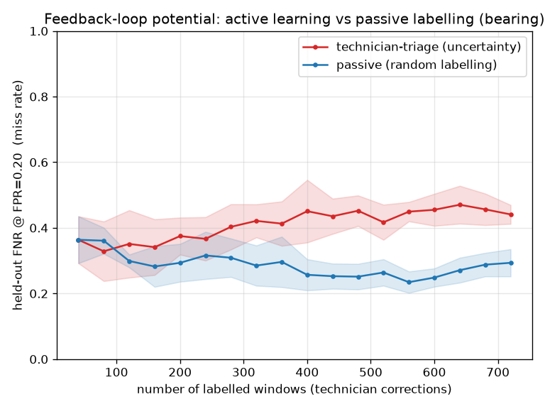

Simulated: representative real labels cut the miss-rate by **~⅓** with a few hundred
corrections. **Design warning from the simulation:** labelling *only the items the
model flags* (uncertainty/triage-only) did **not** help and trended worse — fuzzy
boundary labels, and the normal region never gets re-confirmed. So the UI should also
surface a small **random sample of normal running** to confirm, treat edge labels as
noisy, retrain periodically, and **calibrate the threshold directly from the FP/FN
marks** (a live field estimate of the error rates), favouring low miss-rate.

---

## On-device deployment

Target: Infineon **PSE84 + Ethos-U55** neural accelerator, TensorFlow-Lite-Micro.
Budget (committed compiler report): ~512 KB working memory, ~100% mapped to the
accelerator, ~11.7 ms per inference, input a `[1,49,40,1]` spectrogram. Feasible and
preferred; the box emits only a verdict. The random-forest detectors here are the
**reference algorithm** (feature set + accuracy ceiling); the deployed artifact is the
int8 neural net.

---

## Open items
- **Defective-bearing counts** in the severity sessions are ambiguous (base ≈ 0–1?).
  Confirm exact counts with whoever ran the experiment to firm up the severity slide.
- **Running-wobble recall** unvalidated (no wobble labels on running data).
- **Audio detector** needs more & finer labels (current set is subtle/sparse).
- **Physical fault ground-truth** (colleagues' manual track inspection) — to test
  whether our "false alarms" are actually real unlabeled faults. Gated on localisation
  (separate workstream).
