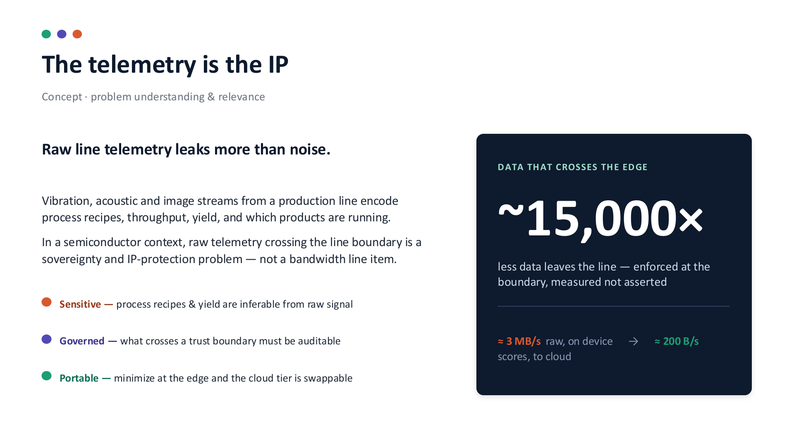
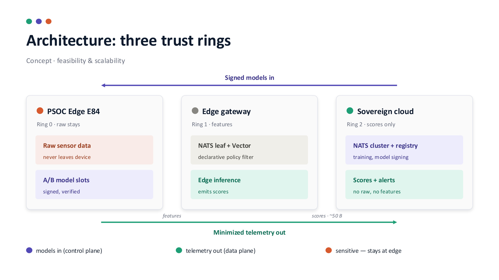

# Pitch deck — rendered slides

Slides exported from the Claude Design deck (`thingkathon-pitch.pdf`). Images here are
the source of truth for what's presented; the narrative/content draft is in
[`../PITCH.md`](../PITCH.md).

## Slide 2 — The telemetry is the IP
*Concept · problem understanding & relevance*

**Raw line telemetry leaks more than noise.** Vibration, acoustic and image streams from a
production line encode process recipes, throughput, yield, and which products are running.
In a semiconductor context, raw telemetry crossing the line boundary is a **sovereignty and
IP-protection** problem — not a bandwidth line item.

- **Sensitive** — process recipes & yield are inferable from the raw signal
- **Governed** — what crosses a trust boundary must be auditable
- **Portable** — minimise at the edge and the cloud tier is swappable

**Data that crosses the edge: ~15,000× less** — enforced at the boundary, measured not
asserted. ≈ 3 MB/s raw on device → ≈ 200 B/s scores to cloud.

## Slide 3 — Architecture: three trust rings
*Concept · feasibility & scalability*

Signed models flow **in** (control plane); minimised telemetry flows **out** (data plane).

- **Ring 0 · PSoC Edge E84 — raw stays.** Raw sensor data never leaves the device; A/B model
  slots (signed, verified). *Sensitive — stays at edge.*
- **Ring 1 · Edge gateway — features.** NATS leaf + Vector declarative policy filter; edge
  inference emits scores.
- **Ring 2 · Sovereign cloud — scores only.** NATS cluster + registry (training, model
  signing); receives scores + alerts, **no raw, no features**.
